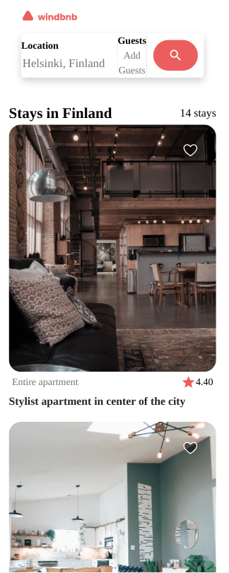
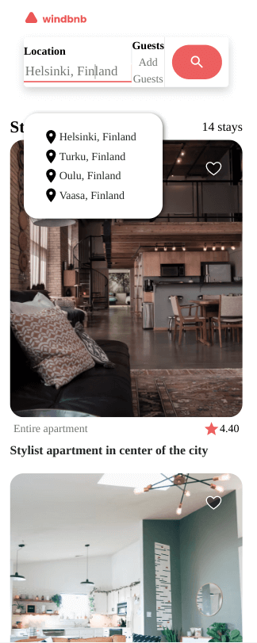
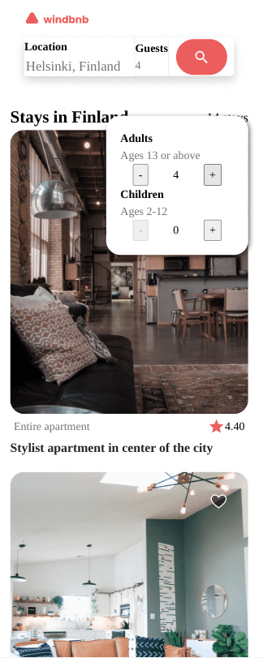
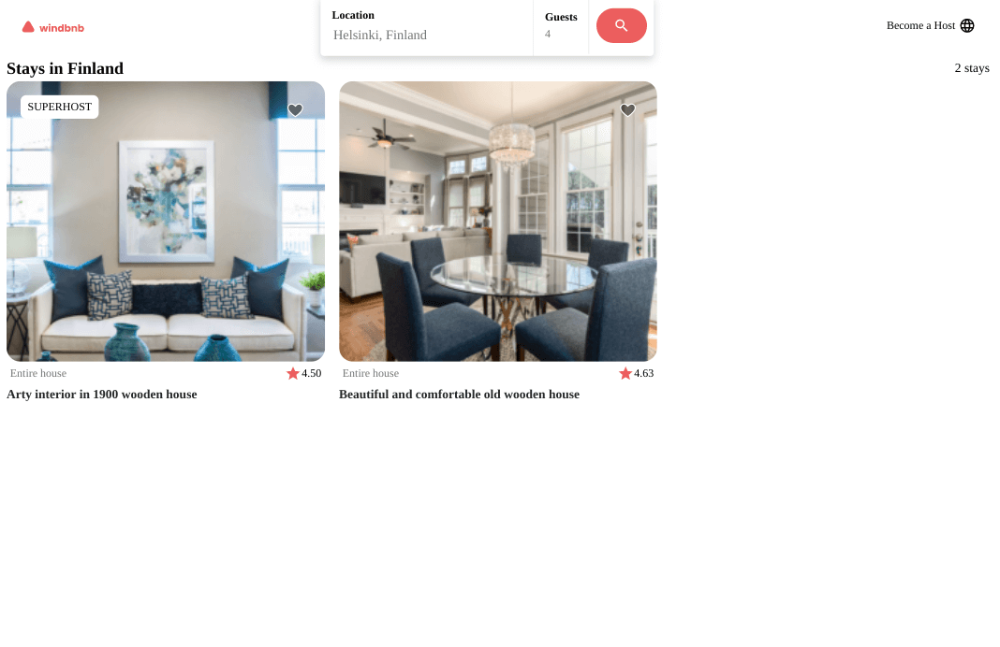

<h1 align="center">Devchallenges Windbnb</h1>

   Solution for a challenge from  <a href="http://devchallenges.io" target="_blank">Devchallenges.io</a>.

  <h3>
    <a href="https://jdegand.github.io/devchallenges-windbnb">
      Live Link
    </a>
     | 
    <a href="https://legacy.devchallenges.io/challenges/3JFYedSOZqAxYuOCNmYD">
      Challenge
    </a>
  </h3>

## Table of Contents

- [Overview](#overview)
  - [Built With](#built-with)
- [Features](#features)
- [Useful Resources](#useful-resources)

## Overview

This was a weird one. The search bar is really a modal in disguise.  In the original design, it seems like you are supposed to be able to click anywhere on the input and the modal animates from the top of the screen.  The modal contains all the real functionality. 

The actual airbnb website search bar is an input, 3 buttons, 3 underlays styled to look like one input.  The bar animates and grows larger and the search text is displayed next to the magnify on focus.  

I tried to implement more of the real airbnb design search bar.

Since I used focus to render the location suggestions panel, you can't tab focus them even though the links are buttons.  The minuses and pluses can be tab focused on the guest panel but you can't click them with your keyboard.

Using svgs representing + & - inside the buttons prevents clicks from registering. 

When hiding content with event listeners, onClick is too slow and you are better off using onMouseDown instead. See [Stack Overflow](https://stackoverflow.com/questions/69632325/element-click-doesnt-fire-when-the-element-gets-hidden).

The images linked in the json are not [small](https://images.unsplash.com/photo-1505873242700-f289a29e1e0f?ixlib=rb-1.2.1&auto=format&fit=crop&w=2255&q=80) and can cause hitching when scrolling. I lowered the image dimensions since the images are only 400px.  

### Built With

- [React](https://reactjs.org/)
- [Material Design Icons](https://materialdesignicons.com/)

## Features

This application/site was created as a submission to a [DevChallenges](https://devchallenges.io/challenges) challenge. The [challenge](https://legacy.devchallenges.io/challenges/3JFYedSOZqAxYuOCNmYD) was to build an application to complete the given user stories.

## Useful Resources

- [Steps to replicate a design with only HTML and CSS](https://devchallenges-blogs.web.app/how-to-replicate-design/)
- [Codepen](https://codepen.io/alexandrecanijo/pen/dLWZmO) - multiple input search bar
- [Codepen](https://codepen.io/ronalson/pen/xLWLZK) - airbnb style search bar
- [Codepen](https://codepen.io/thubz/pen/Pooxegp) - airbnb style search bar
- [Pluralsight](https://www.pluralsight.com/guides/load-and-render-json-data-into-react-components) - load and render json data 
- [YouTube](https://www.youtube.com/watch?v=DonxmmWW7Tk) - focus-within
- [YouTube](https://www.youtube.com/watch?v=WuWbunhmDsE) - airbnb clone
- [YouTube](https://www.youtube.com/watch?v=LyLa7dU5tp8) - modals
- [Blog](https://blog.logrocket.com/build-modal-with-react-portals/) - react portals
- [Codeply](https://www.codeply.com/p/Dv7ynKFM6J) - airbnb style search button
- [Stack Overflow](https://stackoverflow.com/questions/69632325/element-click-doesnt-fire-when-the-element-gets-hidden) - event handler added too late
- [FreeCodeCamp](https://www.freecodecamp.org/news/how-to-make-a-filter-component-in-react/) - filter component in react
- [Stack Overflow](https://stackoverflow.com/questions/43638938/updating-an-object-with-setstate-in-react) - updating an object in react
- [Stack Overflow](https://stackoverflow.com/questions/53048495/does-react-batch-state-update-functions-when-using-hooks) - batching
- [Stack Overflow](https://stackoverflow.com/questions/62111453/react-js-how-to-sequentially-synchronously-update-states-that-depend-on-each) - sequential state updates
- [Stack Overflow](https://stackoverflow.com/questions/41896161/cant-reset-filter-after-clearing-input-react) - reset filter
- [Stack Overflow](https://stackoverflow.com/questions/18176102/swap-placeholder-text-based-on-resolution-media-query) - responsive placeholder texts
- [Power Mapper](https://www.powermapper.com/products/sortsite/rules/accscriptmousedownnokeyboard/) - onmousedown needs keydown event handler
- [CodeSandbox](https://codesandbox.io/s/div-keyboard-management-x30wu?file=/src/App.js:0-1020) - Modal keyboard management
- [Stack Overflow](https://stackoverflow.com/questions/65722635/how-do-i-avoid-unused-setstate-functions-can-react-usestate-be-created-without) - unused setState function
